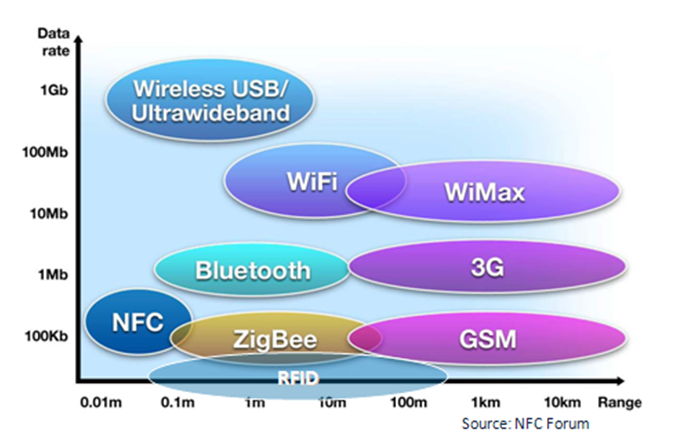
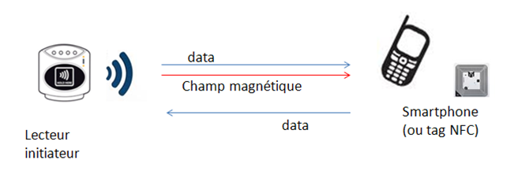
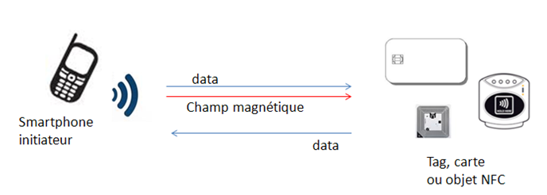
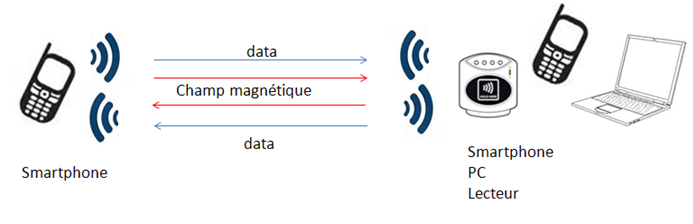

# Technologie RFID et NFC

La technologie RFID (Radio Frequency Identification) est une technologie ancienne car elle est basée sur une technologie apparue en 1939 durant le 2nde guerre mondiale. Il faut attendre 1983 pour que Charles Walton dépose un brevet sur cette technologie. Le RFID permet de mémoriser ou récupérer des données à distance en utilisant des "tags".La communication et l'alimentation se font grâce à un champ magnétique. Le NFC (Near Field Communication) est une technologie basée sur la RFID et qui est utilisée pour faire de la communication sans fil sur de courte portée en utilisant des ondes radio haute fréquence (13.56 MHz). Celle-ci permet de faire des échanges de données sur une distance théorique d'environ 10 cm. Dans la pratique cette distance est plus proche de 5 cm dù aux différentes pertubations lié à notre environnement.
 
### Quels sont les atouts de cette technologie ?
- la simplicité ! 
Cette technologie est simple à mettre en oeuvre car il s'agit d'un simple composant électronique que l'on retrouve dans de nombreux équipements actuels (téléphones, bornes de paiements, divers objets ...). Elle est également simple à utiliser grâce aux applications mobiles développées sous Android. De plus, les manipulations devant être effectuées par l'utilisateur sont limitées car il suffit d'approcher deux appareils compatibles afin que la technologie fasse ce dont elle a été réglée.

- le prix !
A l'heure actuelle le prix du tag NFC est supérieur à celui d'une bande magnétique (technique autrefois utilisée pour les cassettes) mais le prix des lecteurs et bien moins important. De plus, la technologie se répendant, le prix d'un tag NFC va aller en diminuant grâce à la quantité d'objets vendus.

- la rapidité !
Le temps de d'établissement entre la connexion et la communication est quasiment instantané. Ce qui est très différent de la technologie Bluetooth où un appairage des appareils est nécessaires et provoque un temps d'attente assez long. Le débit est certes moins important que celui du Bluetooth (103 ko/s contre 3Mo/s) mais cela est plus que suffisant quant au type d'information transféré.

- la fiabilité !
Même si le téléphone est éteint, la technologie NFC fonctionnera toujours contrairement à l'utilisation des QRCode. Cela rassurera les utilisateurs nottament dans le cadre des e-billets.

  
Si on compare le RFID et le NFC aux autres technologies sans fil en fonction de la portée et de la distance,
  on obtient le diagramme suivant :
  

### Explication d'un "TAG" NFC

### Les 3 modes de fonctionnement entre deux dispositifs NFC

Le NFC dispose de trois modes de fonctionnement :

* Mode émulation de carte : le dispositif NFC se comporte comme une carte à puce et devient 
donc passif, cela nécéssite par contre une source d'énergie car les appareils utilisent généralement
 d'autre fonctionnalités (écran,applications, communication interne), contrairement à un tag NFC par exemple
 qui lui tire son énergie du champs émis par l'intérogateur.

 
 
* Le mode lecteur : l'appareil se compte comme un lecteur de carte sans contac. Il initie la 
communication en émettant un champ magnétique puis en envoyany une commande à la cible. La cible répond
 par rétro-modulation de l'onde incidente (envoyé par le lecteur)

 
 
* Mode Peer-to-Peer : Ce mode permet d'échanger des informations entre deux dispositifs NFC de mêmes niveaux 
de performance. Les appareils émettent des informations tours à tours. Ce mode de communication est plus lent 
du à l'utilisation d'un protocol plus lourd permettant de répartir les rôles entre les deux appareils NFC. 
C'est un mode qui peut servir à appairer des passerelles avec d'autres technologies (bluetooth par exemple).

 

Le NFC dispose de 3 vitesses de communication différentes liés directement avec le mode de fonctionnement :
  
* 106 kbits/s
* 212 kbits/s
* 424 kbits/s

### Fonctionnement d'un appareillage bluetooth

La technologie NFC permet donc par exemple d'appareiller simplement deux appareils. Le tag NFC contenue dans 
l'appareil bluetooth va transmettre son identifiant unique à l'appareil ce qui évite de le selectionner manuellement,
 ensuite les données d'authentification sécurisant la transmission, toutes ces données sont utilisées par le téléphone pour établir la connexion de manière rapide et éfficace, il n'est donc plus nécéssaire de saisir un code ni l'appareil a appairer.

### Application android
 Il éxiste de nombreuses applications android permettant de lire, d'écrire, ou de vérouiller des tags NFC, parmis les plus utilisées, on retrouve une application NXP, qui permet d'utiliser toutes les fonctions NFC possible avec un smartphone (Automatisation d'action, vérouillage de tag, lecture, écriture).

### Applications du NFC déjà existante
- Accès aux transports publics
- Télépéages d'autoroutes
- Contrôles des forfaits de remontées mécanique dans les stations de sports d'hiver
- Suivis industriels sur les chaines de montage
- Antivols dans les magasins
- Identifications des containers comprenant des substances chimiques, des médicaments ...

### Application possible avec le NFC

Il existe plusieurs applications et services autour de la technologie NFC. Parmi ces applications nous pouvons citer les suivantes : 

- Suivi d’inventaire à l'aide de tags
- Ouverture de portes d'entrées
- Système d'authentification (à un évènement, une soirée ...) grâce à un implant
- Utilisation d'une puce RFID en tant que puce d'identification (sous-cutanée)
- Utilisation de tag NFC pour récuperer une image ou un plan
- Paiement sans contact pour les téléphones ou cartes bancaires
- Reconnaissance des produits dans un réfrigérateur et possibilité de controler les DLC
- Identification des produits pour un passage en caisse plus rapide (plus besoin de chercher le code barre)

### Quelles sont les sécurités mises en place afin de protéger mes données ?

### Utilisation de lecteur/graveur sous linux

 Il existe des bibliothèques pour pouvoir utiliser différents lecteurs graveurs sous linux, on peut prendre l'exemple de nfcpy, qui est une bibliothèque écrite en python permettant d'utiliser plusieurs appareils pour les technologies nfc et rfid, le majeurs inconvéniant est le nombre restreint d'appareils compatibles (une dizaine d'appareils seulement).

### Utilisation de la carte Explore 14 par NXP avec la bibliothèque nxppy

#### Première application

  La première application consiste à utiliser notre carte NXP pour lire différents types de tags, pour ce faire, on réalise un programme python qui va lire en boucle et nous afficher l'uid des cartes.

#### Seconde Application

 La seconde application consiste à utiliser notre carte NXP pour écrire sur la carte NFC Mifare fourni. Il est possible d'écrire sur la carte, celle-ci est composée de plusieurs bloques, chacun ayant une capacité de 4 octets. Pour aller lire les données que l'on vient de mettre dans la carte, il faudra ensuite aller lire les bloque sur lesquels nous avons insérer les données.

#### Bibliothèques à disposition

Les bibliothèques suivantes sont disponibles pour une utilisation de la carte NXP
 * nxppy : qui est une bibliothèque codée en python et qui permet de lire et d'écrire des tags NFC
 * nxp reader library : qui est une bibliothèque écrite en C par NXP et qui permet d'utiliser touts les modes de fonctionnement de la carte
 
Il éxiste également d'autre bibliothèques pour l'utilisation du NFC sous linux, celles que nous allons vous présenter sont libre :
 * nfcpy : qui est une bibliothqèe python permettant d'utiliser des lecteurs/graveurs USB sous linux, une dizaine de produits sont compatible avec nfcpy, mais aucun ne permet d'utiliser toutes les fonctions NFC.
 * libnfc : qui est une bibliothqèe C qui permet l'utilisation de dongle NFC sous linux, windows, et Mac OS X, tout comme nfcpy, une dizaine de dongle USB peuvent être utilisé mais aucun dongle ne dispose de toutes les fonctionnalités possibles
